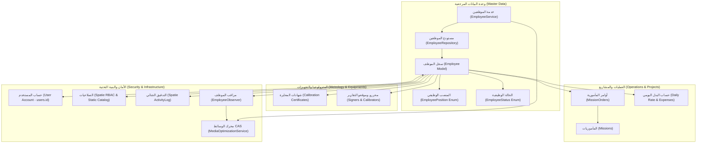

# وثيقة مواصفات النقل المعماري والتوثيق المرجعي (As-Built Specification)
## وحدة إدارة الموظفين (Employees Module) — نواة ENGI-GMTM Core Kernel

> **النظام:** ENGI-GMTM Core Kernel (v1.0.50) | GMTM ERP  
> **البيئة التقنية:** Laravel 13.x | PHP 8.4+ (Strict Types) | Tailwind CSS (Class-based Dark Mode & Isolated RTL/LTR Bundles) | Alpine.js 3.x  
> **الموقع المعماري:** وحدة البيانات المرجعية (`Master Data / Reference Data`) — المسار: `/master-data/employees`  
> **تاريخ الإنجاز والاعتماد:** سبتمبر 2026  
> **الحالة:** منجز ومفعّل بالكامل في الإنتاج ومطابق تماماً لميثاق المعمارية والقواعد الحاكمة (Fully Implemented & Verified — ADR-031, ADR-034)

---

### 1. نظرة عامة على الوحدة والترابط المعماري (Module Overview & Domain Architecture)

#### 1.1 الهدف البزنسي والوظيفي (Business & Functional Purpose)
تمثل وحدة إدارة الموظفين (`Employees Module`) الركيزة المركزية لإدارة الكادر البشري الهندسي، الفني، والمترولوجي داخل مؤسسة GMTM. تختص الوحدة بإدارة الكفاءات والكوادر المتخصصة (مهندسو القياس والمترولوجيا القانونية والصناعية، تقنيو الأجهزة الدقيقة، والإدارة التنفيذية) المسؤولة عن تنفيذ عقود المعايرة الميدانية، الفحص، وإصدار شهادات المعايرة والتقارير المترولوجية المطابقة للمعايير الدولية (OIML R 117, OIML R 140).

في المعمارية الحالية المعتمدة، تم إنجاز وترسيخ الأهداف التالية:
1. **التصنيف ضمن البيانات المرجعية (`Master Data`):** ترسيخ الموظف ككيان مرجعي أصيل (`Reference Entity`) تنطلق منه مأموريات العمل، التعيينات، ومصفوفة التوقيعات المعتمدة.
2. **الضبط الرقمي للهوية الوظيفية:** منح كل موظف كود قيد وظيفي فريد (`registration_number`) وتحديد منصبه بدقة عبر الـ Enums المعتمدة (`EmployeePosition`).
3. **التكامل مع منظومة الصور ومحرك CAS (`ADR-009`):** تخزين صور الهوية والملفات الشخصية عبر محرك التحسين والضغط اللحظي بصيغة WebP مع تفادي تكرار البيانات بتقنية التخزين المعنون بالمحتوى (SHA-256 CAS Deduplication) ومراقبة الحذف الآمن عبر `EmployeeObserver`.
4. **تتبع الحالة التشغيلية والتعاقدية:** إدارة الحالة (`active`, `inactive`, `on_leave`) للتحكم البرمجي في الجاهزية للمهام الميدانية.
5. **إدارة التعويضات والأجور مع العزل الأمني المشدد (`ADR-031`):** تسجيل الأجر الأساسي (`salary`) والبدل الميداني اليومي للمأموريات (`daily_rate`) مع فرض حجر أمني مشدد (Financial Data Quarantine) يحجب هذه البيانات عن غير حاملي صلاحية `view employee compensation` واستبدالها بقناع نقطي (`•••••••• DZD`).
6. **الربط التفاعلي بحسابات المستخدمين (`ADR-031`):** ربط سجل الموظف بحساب المستخدم (`employees.user_id -> users.id`) عبر قوائم اختيار تفاعلية في نوافذ الإضافة والتعديل مع دعم فك الارتباط (`None`)، وعرض تفاصيل الحساب المرتبط في الجدول مع التحميل المسبق (`with('user')`) لمنع مشكلة استعلامات `N+1`.
7. **هجرة البيانات التاريخية وتثبيت المفاتيح الأساسية (`ADR-031`):** استيراد ونقل موظفي الشركة السبعة من قاعدة البيانات السابقة مع الحفاظ الصارم على أرقام المفاتيح الأساسية (`id`: 1, 2, 3, 4, 5, 25, 26) لضمان عدم انكسار العلاقات المستقبلية في أوامر المأموريات والشهادات.

#### 1.2 الترابط الشبكي ومخطط الاعتمادية (Inter-Module Dependency Graph)



* **وحدة المأموريات والعمليات (`Operations & Projects`):**
  * يرتبط الموظفون بالمأموريات عبر أوامر المأمورية `mission_orders`.
  * تعتمد حسابات تكاليف المهام والمصاريف الميدانية على استخراج البدل اليومي (`daily_rate`) وعنوان السكن (`address`).
  * **قيد الأمان والحذف:** إطلاق استثناء نطاقي مخصص `CannotDeleteAssignedEmployeeException` لمنع حذف أي موظف مرتبط بمأموريات جارية أو تاريخية.
* **وحدة المترولوجيا والأجهزة (`Metrology & Equipments`):**
  * تعيين مهندسي القياس كمسؤولين معتمدين عن المعايرة الميدانية وإصدار شهادات المعايرة وتقارير الفحص المترولوجي.
* **وحدة المستخدمين والأمان (`System Security & Users`):**
  * ربط اختياري مرن (`employees.user_id -> users.id`) مع خاصية `ON DELETE SET NULL`.
* **محرك الوسائط وعدم تسريب المساحة (`MediaOptimizationService`):**
  * معالجة الصور الشخصية بالتحويل الإجباري إلى `.webp` بنسبة جودة 80%، وأبعاد محكومة بحد أقصى 1920px، مع تشفير SHA-256 CAS لمنع التكرار وحذف الملفات المؤقتة تلقائياً (Process & Destroy).
* **نظام التدقيق الجنائي (`Activity Log`):**
  * تسجيل فوري لجميع عمليات الإنشاء والتعديل وتغيير الرواتب والحالات تحت سجل `'employees'`.

---

### 2. خريطة قاعدة البيانات والضوابط الفنية (Database Schema Snapshot)

جدول `employees` مفعّل حالياً في قاعدة البيانات `gmtmdz_erp` وفق ملف الهجرة المعتمد:
[database/migrations/2026_09_13_093000_create_employees_table.php](file:///c:/Project%20HARD/erp.gmtm-dz.com/database/migrations/2026_09_13_093000_create_employees_table.php)

| اسم العمود (Column) | النوع المعتمد (Data Type) | Nullable | القيمة الافتراضية | الفهارس والقيود (Constraints & Indexes) | الوظيفة والدلالة المعمارية |
|---|---|:---:|---|---|---|
| **`id`** | `bigint unsigned` | لا | `AUTO_INCREMENT` | `PRIMARY KEY` | المفتاح الأساسي المعياري لنظام Laravel. |
| **`user_id`** | `bigint unsigned` | نعم | `NULL` | `FK -> users(id)` (`nullOnDelete`) | مفتاح أجنبي اختياري يربط الموظف بحسابه في النظام. |
| **`full_name`** | `varchar(150)` | لا | `NULL` | `INDEX (employees_full_name_index)` | الاسم الكامل للموظف، مفهرس لسرعة البحث والتصفية. |
| **`registration_number`** | `varchar(50)` | لا | `NULL` | `UNIQUE (employees_registration_number_unique)` | كود القيد الوظيفي الفريد (مثل `EMP-2026-001` أو المعرف القديم). |
| **`position`** | `varchar(50)` | لا | `NULL` | خاضع لـ `EmployeePosition` Enum | المنصب المهني المعتمد. |
| **`status`** | `varchar(20)` | لا | `'active'` | `INDEX (employees_status_index)` | الحالة التشغيلية للموظف (`active`, `inactive`, `on_leave`). |
| **`join_date`** | `date` | لا | `NULL` | تاريخ قياسي `Y-m-d` | تاريخ التوظيف الرسمي لحساب الأقدمية والاستحقاقات. |
| **`salary`** | `decimal(12,2)` | لا | `'0.00'` | `min:0` (خاضع للحجر المالي) | الراتب الأساسي الشهري بالدينار الجزائري (DZD). |
| **`daily_rate`** | `decimal(10,2)` | لا | `'0.00'` | `min:0` (خاضع للحجر المالي) | بدل المأمورية الميداني اليومي بالدينار الجزائري (DZD). |
| **`address`** | `varchar(255)` | نعم | `NULL` | — | عنوان الإقامة لتنظيم مسارات التنقل والمأموريات. |
| **`profile_photo_path`** | `varchar(2048)` | نعم | `NULL` | مسار نسبي في قرص `public` | مسار صورة الهوية الشخصية المحسنة بصيغة WebP. |
| **`photo_hash`** | `varchar(64)` | نعم | `NULL` | بصمة SHA-256 CAS | بصمة محتوى الصورة لتفادي تكرار التخزين (Deduplication). |
| **`created_at`** | `timestamp` | نعم | `NULL` | — | تاريخ ووقت إنشاء السجل في النظام. |
| **`updated_at`** | `timestamp` | نعم | `NULL` | — | تاريخ ووقت آخر تعديل للسجل. |
| **`deleted_at`** | `timestamp` | نعم | `NULL` | `SoftDeletes` | الحذف اللين لحماية السجلات التاريخية والمترولوجية. |

> [!IMPORTANT]
> **قاعدة تفرد رقم القيد مع الحذف اللين (Unique Constraint with SoftDeletes):**  
> في Form Requests (`StoreEmployeeRequest` و `UpdateEmployeeRequest`)، يتم تطبيق القاعدة القياسية:  
> `Rule::unique('employees', 'registration_number')->withoutTrashed()`  
> وفي حال التعديل:  
> `Rule::unique('employees', 'registration_number')->ignore($employeeId)->withoutTrashed()`

---

### 3. التعدادات البرمجية المدعومة (PHP 8.4 Backed Enums)

#### 3.1 منصب الموظف ([app/Enums/EmployeePosition.php](file:///c:/Project%20HARD/erp.gmtm-dz.com/app/Enums/EmployeePosition.php))
```php
namespace App\Enums;

enum EmployeePosition: string
{
    case GeneralManager = 'general_manager';
    case SeniorMeteringEngineer = 'senior_metering_engineer';
    case MeteringEngineer = 'metering_engineer';
    case SeniorInstrumentationEngineer = 'senior_instrumentation_engineer';
    case MeteringTechnician = 'metering_technician';
    case InstrumentationTechnician = 'instrumentation_technician';

    public function label(): string;          // تسمية ثلاثية مترجمة عبر __('...')
    public function badgeVariant(): string;   // رمز السيمانتيك: 'primary' | 'info' | 'neutral'
    public function isEngineer(): bool;       // فحص هل المنصب رتبة هندسية
    public function isTechnician(): bool;     // فحص هل المنصب رتبة فنية
    public function isManagement(): bool;     // فحص هل المنصب إدارة تنفيذية
    public static function values(): array;
}
```

#### 3.2 الحالة الوظيفية ([app/Enums/EmployeeStatus.php](file:///c:/Project%20HARD/erp.gmtm-dz.com/app/Enums/EmployeeStatus.php))
```php
namespace App\Enums;

enum EmployeeStatus: string
{
    case Active = 'active';
    case Inactive = 'inactive';
    case OnLeave = 'on_leave';

    public function label(): string;        // Active, Inactive, On Leave
    public function badgeVariant(): string; // رمز السيمانتيك: 'success' | 'danger' | 'warning'
    public function isActive(): bool;       // فحص الحالة النشطة
    public static function values(): array;
}
```

---

### 4. هيكل طبقة الباك-إند والمعمارية النظيفة (Backend Clean Architecture)

تم توزيع كافة الملفات وفق نمط المعمارية النظيفة دون خلط للمسؤوليات:

```
app/
├── Console/
│   └── Commands/
│       └── ImportLegacyEmployeesCommand.php   # أمر الاستيراد: php artisan employees:import-legacy
├── Enums/
│   ├── EmployeePosition.php                  # المناصب المهنية والهندسية
│   └── EmployeeStatus.php                    # الحالات التشغيلية
├── Exceptions/
│   └── CannotDeleteAssignedEmployeeException.php # استثناء حماية الموظفين المرتبطين بمهام
├── Http/
│   ├── Controllers/
│   │   └── MasterDataController.php          # متحكم نحيف يدير CRUD الموظفين والتابس
│   └── Requests/MasterData/
│       ├── StoreEmployeeRequest.php          # التحقق من إنشاء الموظف وقيد الفرادة
│       └── UpdateEmployeeRequest.php          # التحقق من تعديل الموظف وقيد الفرادة
├── Interfaces/
│   └── EmployeeRepositoryInterface.php       # واجهة المستودع
├── Models/
│   └── Employee.php                          # النموذج المعتمد مع ActivityLog و Filterable
├── Observers/
│   └── EmployeeObserver.php                  # حوسبة SHA-256 CAS وحذف الصور الآمن
├── Policies/
│   └── EmployeePolicy.php                    # سياسة الوصول وحماية الرواتب
├── Repositories/
│   └── EmployeeRepository.php                # مستودع البيانات مع with('user') Eager Loading
└── Services/
    └── EmployeeService.php                   # منطق الأعمال والـ Transactions والوسائط
```

#### 4.1 تفاصيل الطبقات المنفذة:
1. **المتحكم النحيف ([MasterDataController.php](file:///c:/Project%20HARD/erp.gmtm-dz.com/app/Http/Controllers/MasterDataController.php)):**
   - دوال الموظفين: `employees(Request $request)`, `storeEmployee(StoreEmployeeRequest $request)`, `updateEmployee(UpdateEmployeeRequest $request, Employee $employee)`, `destroyEmployee(Employee $employee)`.
   - يمرر قائمة المستخدمين النشطين مرتبة أبجدياً (`$users = User::select(['id', 'name', 'email'])->orderBy('name')->get()`) لدعم الربط في النوافذ المنبثقة.
2. **المستودع المحسن ([EmployeeRepository.php](file:///c:/Project%20HARD/erp.gmtm-dz.com/app/Repositories/EmployeeRepository.php)):**
   - يرث من `BaseRepository` ويطبق `EmployeeRepositoryInterface`.
   - دالة `paginateWithFilter` تطبق تلقائياً التحميل المسبق للعلاقة: `->with('user')` لمنع استعلامات `N+1` عند عرض الموظفين.
   - مربوط ومسجل مركزياً داخل [app/Providers/RepositoryServiceProvider.php](file:///c:/Project%20HARD/erp.gmtm-dz.com/app/Providers/RepositoryServiceProvider.php).
3. **طبقة الخدمات ([EmployeeService.php](file:///c:/Project%20HARD/erp.gmtm-dz.com/app/Services/EmployeeService.php)):**
   - ترث من `BaseService` وتنفذ العمليات داخل `executeInTransaction`.
   - معالجة الصور عبر `MediaOptimizationService::optimizeImage` في مسار `'employees/avatars'`.
   - فحص الارتباط بالمأموريات وإطلاق استثناء `CannotDeleteAssignedEmployeeException` عند محاولة حذف موظف مرتبط.
4. **المراقب الذكي ([EmployeeObserver.php](file:///c:/Project%20HARD/erp.gmtm-dz.com/app/Observers/EmployeeObserver.php)):**
   - مربوط على نموذج `Employee` عبر السمة الحديثة `#[ObservedBy([EmployeeObserver::class])]`.
   - يحسب بصمة `photo_hash` آلياً عند تغير الصورة، ويحذف الملفات القديمة بأمان عبر `safeDelete()`.
5. **طلبات التحقق (Form Requests):**
   - [StoreEmployeeRequest.php](file:///c:/Project%20HARD/erp.gmtm-dz.com/app/Http/Requests/MasterData/StoreEmployeeRequest.php) و [UpdateEmployeeRequest.php](file:///c:/Project%20HARD/erp.gmtm-dz.com/app/Http/Requests/MasterData/UpdateEmployeeRequest.php).
   - تدعم التحقق من `user_id` (`nullable|integer|exists:users,id`) والصورة (`image|mimes:jpeg,png,jpg,webp|max:5120`) ورقم التسجيل والمناصب.

---

### 5. واجهة المستخدم ومكونات التصميم الموحدة (UI & Blade Components)

تلتزم واجهة الموظفين في [resources/views/master-data/employees.blade.php](file:///c:/Project%20HARD/erp.gmtm-dz.com/resources/views/master-data/employees.blade.php) بالمعايير القياسية:

1. **الهيكل العام والتنقل:**
   - تصميم متجاوب كامل العرض (`w-full px-4 sm:px-6 lg:px-8`) دون تحديد عرض ثابت.
   - الشريط الجانبي المرجعي: `<x-master-data-tabs active="employees" />`.
2. **جدول البيانات المعماري (`<x-table>`):**
   - شريط الأدوات الموحد: `<x-global-filter>` مع فلترة بالاسم والكود والعنوان، وقوائم تصفية للمناصب والحالات.
   - زر الإنشاء الرئيسي البرتقالي: `<x-primary-button @click="showCreateModal = true">`.
   - أعمدة الجدول: `ID`, `Employee`, `Position`, `Status`, `Compensation`, `Join Date`, `Actions`.
   - بطاقة الموظف: تعرض الصورة المحسنة أو دائرة الحروف الأولى (`initials`) مع الاسم، رقم التسجيل، وعند وجود حساب مستخدم مرتبط يظهر اسم المستخدم مع أيقونة التحقق وتلميح بريده الإلكتروني.
   - **قناع حماية الرواتب:** إظهار الأرقام لمن يملك صلاحية `view employee compensation` وإظهار القناع المشفر `•••••••• DZD` لمن لا يملكها.
   - أزرار الإجراءات القياسية: `<x-table.action-edit>` (Amber) و `<x-table.action-delete>` (Rose).
3. **النوافذ المنبثقة لإدارة الموظفين (Alpine.js Modals):**
   - **نافذة الإنشاء (`<x-crud-modal.form>`):** معاينة حية فورية للصورة الشخصية، حقول الاسم، رقم القيد، المنصب، الحالة، تاريخ الانضمام، **قائمة اختيار حساب المستخدم المرتبط (`create_user_id`)**، العنوان، وحقول الرواتب والبدلات المحمية.
   - **نافذة التعديل (`<x-crud-modal.form>`):** تدعم تعديل كافة البيانات بما في ذلك **تعديل أو فك ربط حساب المستخدم (`edit_user_id`)** عبر `x-model="editEmployeeUserId"` واستبدال أو حذف الصورة الحالية.
   - **نافذة تأكيد الحذف (`<x-crud-modal.delete>`):** متوافقة مع متطلبات الحذف الآمن وتأكيد اسم الموظف المستهدف.

---

### 6. منظومة الأمان والحجر المالي والصلاحيات (RBAC & Financial Quarantine)

#### 6.1 الصلاحيات المسجلة في القائمة الثابتة ([config/permissions.php](file:///c:/Project%20HARD/erp.gmtm-dz.com/config/permissions.php)):
مسجلة تحت مجموعة `master_data` -> `employees`:
- `view employees`: استعراض قائمة الموظفين وتفاصيلهم المهنية العامة.
- `create employees`: تسجيل موظف جديد ورفع صورته وبياناته.
- `edit employees`: تعديل بيانات الموظف والترقيات والربط بالمستخدم.
- `delete employees`: حذف سجل الموظف (غير المرتبط بمهام).
- **`view employee compensation` (صلاحية تخصصية سرية):** كشف وقراءة وتعديل الراتب الأساسي (`salary`) والبدل الميداني اليومي (`daily_rate`).

#### 6.2 المزامنة والأدوار السيادية:
- جميع الصلاحيات الـ 5 متزامنة في قاعدة البيانات وممنوحة تلقائياً لدور `Super-Admin` عبر الأمر `php artisan permissions:sync-tables`.
- يتم تجاوز القيود مركزياً لـ `Super-Admin` عبر بوابة `Gate::before`.

---

### 7. التوطين الثلاثي المتزامن بنسبة 100% (Trilingual Localization)

تلتزم الوحدة بمبدأ المفاتيح الإنجليزية الموحدة والمزامنة التامة عبر القواميس الثلاثة (`lang/en.json`, `lang/ar.json`, `lang/fr.json`) بإجمالي **780 مفتاحاً متطابقاً في كل ملف وصفر مفاتيح مفقودة**:

| المفتاح المعتمد (Master Key) | الترجمة العربية (`lang/ar.json`) | الترجمة الفرنسية (`lang/fr.json`) |
|---|---|---|
| `Employees` | `الموظفون` | `Employés` |
| `Staff registry, job positions, and human resource profiles` | `سجل الموظفين، المناصب المهنية، وملفات الموارد البشرية` | `Registre du personnel, postes et profils des ressources humaines` |
| `Employee` | `الموظف` | `Employé` |
| `New Employee` | `موظف جديد` | `Nouvel employé` |
| `Edit Employee` | `تعديل بيانات الموظف` | `Modifier l'employé` |
| `Registration Number` | `رقم القيد الوظيفي` | `Numéro matricule` |
| `Position` | `المنصب الوظيفي` | `Poste` |
| `Join Date` | `تاريخ التوظيف` | `Date d'embauche` |
| `Daily Rate` | `البدل اليومي للمأمورية` | `Indemnité journalière` |
| `Salary` | `الراتب الأساسي` | `Salaire de base` |
| `Compensation` | `البيانات المالية والتعويضات` | `Rémunération et indemnités` |
| `Financial Compensation (Confidential)` | `البيانات المالية والتعويضات (سرية)` | `Rémunération financière (Confidentiel)` |
| `Base Salary (DZD)` | `الراتب الأساسي (د.ج)` | `Salaire de base (DZD)` |
| `Mission Daily Rate (DZD)` | `البدل اليومي للمأمورية (د.ج)` | `Indemnité journalière de mission (DZD)` |
| `Linked System User (Optional)` | `حساب المستخدم المرتبط (اختياري)` | `Utilisateur système associé (Optionnel)` |
| `None (Not linked to user account)` | `لا يوجد (غير مرتبط بحساب مستخدم)` | `Aucun (Non associé à un compte utilisateur)` |
| `Linked to system user` | `مرتبط بمستخدم في النظام` | `Lié à un utilisateur du système` |
| `General Manager` | `المدير العام` | `Directeur Général` |
| `Senior Metering Engineer` | `مهندس قياس ومترولوجيا رئيسي` | `Ingénieur principal de comptage` |
| `Metering Engineer` | `مهندس قياس ومترولوجيا` | `Ingénieur de comptage` |
| `Senior Instrumentation Engineer` | `مهندس أجهزة دقيقة رئيسي` | `Ingénieur principal en instrumentation` |
| `Metering Technician` | `تقني قياس ومترولوجيا` | `Technicien de comptage` |
| `Instrumentation Technician` | `تقني أجهزة دقيقة` | `Technicien en instrumentation` |
| `Cannot delete an employee assigned to active or historical missions.` | `لا يمكن حذف موظف مرتبط بمأموريات جارية أو تاريخية.` | `Impossible de supprimer un employé affecté à des missions actives ou historiques.` |
| `Employee created successfully.` | `تم تسجيل الموظف بنجاح.` | `Employé créé avec succès.` |
| `Employee updated successfully.` | `تم تحديث بيانات الموظف بنجاح.` | `Employé mis à jour avec succès.` |
| `Employee deleted successfully.` | `تم حذف سجل الموظف بنجاح.` | `Employé supprimé avec succès.` |

---

### 8. هجرة ونقل البيانات التاريخية المنفذة (Executed Legacy Data Migration)

تم إنجاز استيراد وتحويل بيانات موظفي النظام السابق بالكامل وتثبيتهم في جدول `employees`:
- **سكربت البذور الدائم:** [database/seeders/LegacyEmployeeSeeder.php](file:///c:/Project%20HARD/erp.gmtm-dz.com/database/seeders/LegacyEmployeeSeeder.php) مسجل في [DatabaseSeeder.php](file:///c:/Project%20HARD/erp.gmtm-dz.com/database/seeders/DatabaseSeeder.php).
- **أمر Artisan المخصص:** [app/Console/Commands/ImportLegacyEmployeesCommand.php](file:///c:/Project%20HARD/erp.gmtm-dz.com/app/Console/Commands/ImportLegacyEmployeesCommand.php) (`php artisan employees:import-legacy`).

#### جدول السجلات السبعة المستوردة والمثبتة في قاعدة البيانات:
| ID | الاسم الكامل (Full Name) | رقم التسجيل | المنصب المعتمد (Position Enum) | الراتب الأساسي | البدل اليومي | الحالة | تاريخ التوظيف | حساب المستخدم المرتبط |
|:---:|:---|:---:|:---|:---:|:---:|:---:|:---:|:---:|
| **1** | **MAYATA Nadhir** | `Nadhir` | `metering_engineer` | 75,000.00 DZD | 8,000.00 DZD | active | 2026-03-05 | مرتبط مع `user_id = 1` (`mayatanadhir@gmail.com`) |
| **2** | **MAYATA Raouf** | `Raouf` | `senior_metering_engineer` | 80,000.00 DZD | 10,000.00 DZD | active | 2026-03-05 | `NULL` |
| **3** | **ASMA Younes** | `Younes` | `senior_metering_engineer` | 140,000.00 DZD | 10,000.00 DZD | active | 2026-03-16 | `NULL` |
| **4** | **MAYATA Ahmed** | `Ahmed` | `general_manager` | 0.00 DZD | 0.00 DZD | active | 2026-03-16 | `NULL` |
| **5** | **BOUGUERN Mourad** | `Mourad` | `senior_instrumentation_engineer` | 0.00 DZD | 30,000.00 DZD | active | 2026-03-16 | `NULL` |
| **25** | **GUEBLI Imed-Eddine** | `Imed` | `metering_engineer` | 0.00 DZD | 8,000.00 DZD | active | 2026-05-11 | `NULL` |
| **26** | **Amir CHIRIF** | `Amir` | `instrumentation_technician` | 0.00 DZD | 0.00 DZD | active | 2026-07-24 | `NULL` |

---

### 9. الاختبارات المؤتمتة وضمان الجودة (Automated Testing & QA Verification)

كلاس الاختبار المعتمد: [tests/Feature/MasterData/EmployeeTest.php](file:///c:/Project%20HARD/erp.gmtm-dz.com/tests/Feature/MasterData/EmployeeTest.php)

#### الحالات الـ 12 المغطاة بنسبة نجاح 100% (41 تأكيداً):
1. `test_guests_are_redirected_to_login`: إعادة توجيه الزوار غير المصرح لهم لصفحة الدخول.
2. `test_user_without_permission_cannot_view_employees`: منع استعراض الموظفين بدون صلاحية `view employees` (403 Forbidden).
3. `test_user_with_permission_can_view_employees_list`: نجاح استعراض قائمة الموظفين لممتلكي الصلاحية.
4. `test_financial_compensation_is_masked_without_specific_permission`: حجب بيانات الراتب والبدل وإظهار القناع النقطي بدون صلاحية `view employee compensation`.
5. `test_user_with_compensation_permission_can_view_financial_data`: ظهور الرواتب والبدلات لحاملي الصلاحية المالية.
6. `test_super_admin_bypasses_all_employee_permissions`: تجاوز `Super-Admin` لكافة قيود الوصول.
7. `test_authorized_user_can_create_employee_with_photo_and_webp_conversion`: إنشاء موظف مع رفع الصورة وضغطها إلى WebP وحساب `photo_hash`.
8. `test_authorized_user_can_update_employee`: تعديل بيانات الموظف والمنصب والحالة بنجاح.
9. `test_authorized_user_can_soft_delete_employee`: الحذف اللين وسريان مفعول `deleted_at`.
10. `test_employee_creation_validates_unique_registration_number`: فشل إنشاء موظف برقم تسجيل مكرر.
11. `test_filtering_by_position_and_status`: اختبار فلاتر البحث والمناصب والحالات.
12. `test_authorized_user_can_create_and_update_employee_with_linked_user`: إنشاء وتعديل وفك ربط حساب المستخدم (`user_id`) بالموظف بنجاح تام.

* **تنسيق الأكواد:** مطابقة 100% لمعايير `Laravel Pint` عبر تشغيل `vendor/bin/pint --dirty --format agent`.